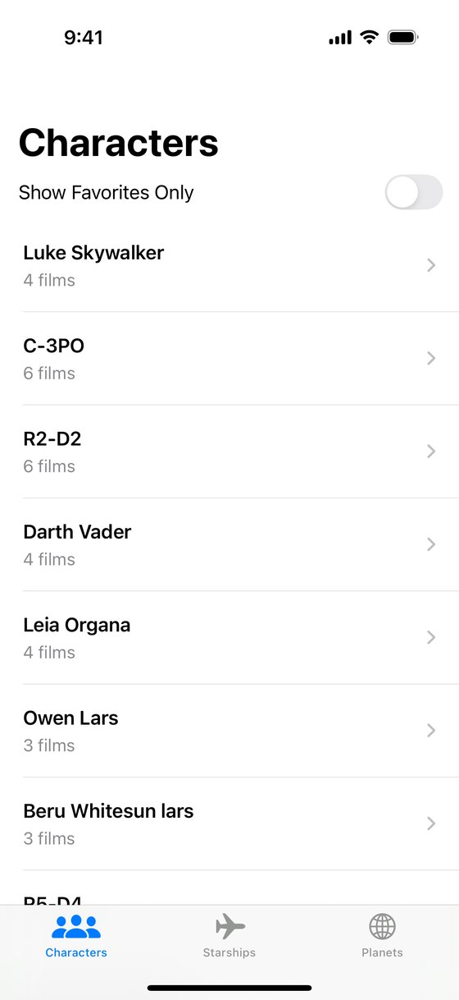
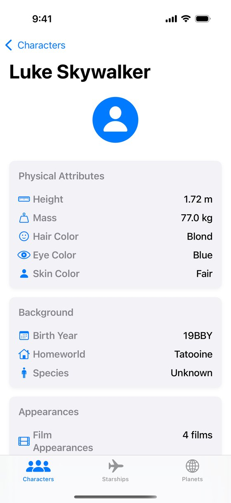
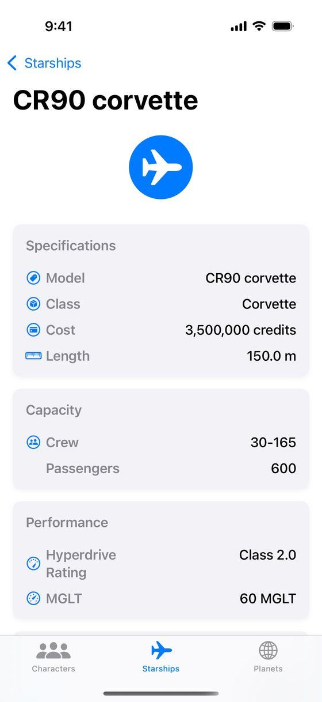
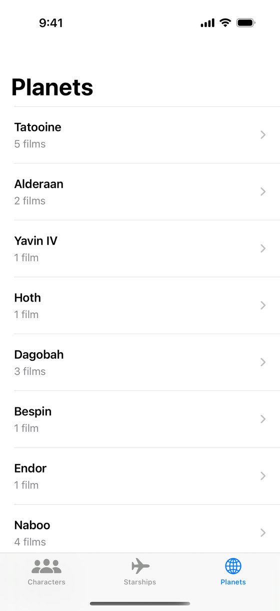

# Star Wars Explorer

A native iOS app for browsing characters, planets and starships from the Star Wars universe, built with SwiftUI and MVVM. Data comes from a GraphQL API through Apollo iOS with generated Swift types, is cached in SQLite for offline use, and the app is protected with Face ID and a PIN fallback.

<p>
  
  
  
  
</p>

## Features

### Characters
- Browse characters from the Star Wars universe
- View detailed information for each character including:
- Mark characters as favorites
- Pull-to-refresh for latest data
- Infinite scrolling pagination

### Planets
- Browse planets from the Star Wars universe
- View detailed information for each planet including:
- Pull-to-refresh for latest data
- Infinite scrolling pagination

### Starships
- Browse starships from the Star Wars universe
- View detailed information for each starship including:
- Pull-to-refresh for latest data
- Infinite scrolling pagination

### Authentication
- Secure access with biometric authentication (Face ID)
- PIN code fallback for devices without biometric capabilities (PIN: 1234)

## Technical Details

### Architecture
- SwiftUI-based user interface
- MVVM architecture pattern
- Apollo Client for GraphQL integration
- Local SQLite caching for offline access

### Apollo Client Integration
The app uses Apollo iOS client for type-safe GraphQL queries with the following features:
- Generated Swift types from GraphQL schema
- Strong typing for all API responses
- Persistent SQLite cache for improved performance and offline use
- Automatic mapping between GraphQL and app model types

### GraphQL Schema
The app connects to a Star Wars GraphQL API at https://swapi-bechir.vercel.app/graphql, served by [swapi-graphql](https://github.com/bechirboujelbene/swapi-graphql).

## Getting Started

### Prerequisites
- Xcode 16+
- iOS 18 (device or simulator)

### Installation
1. Clone this repository
2. Open `StarWars.xcodeproj` in Xcode
3. Install dependencies using Swift Package Manager (automatically handled by Xcode)
4. Build and run the project on your iOS device or simulator
5. In the simulator Face ID is not enrolled, so the app asks for the PIN: `1234`

### Apollo Code Generation
If you need to regenerate the Apollo GraphQL code:

1. Install the Apollo iOS CLI if you haven't already:
   ```
   npm install -g apollo-ios-cli
   ```

2. Run code generation from the project root:
   ```
   apollo-ios-cli generate
   ```

## Usage Guide

### Authentication
- On first launch, you'll be prompted to enable biometric authentication
- You can also set up a PIN code as a fallback

### Browsing Characters/Planets/Starships
- Use the tab bar at the bottom to switch between characters, planets, and starships
- Scroll through the list to browse items
- Pull down to refresh the list with the latest data
- Scroll to the bottom to automatically load more items

### Viewing Details
- Tap on any list item to view detailed information
- Details are organized into logical sections with relevant icons

### Managing Favorites (Characters)
- Swipe right-to-left on a character to access the favorite/unfavorite action
- Tap the star icon to add/remove from favorites
- Use the "Show Favorites Only" toggle to filter the list

## Data Sources
All data is fetched from the SWAPI GraphQL API, which is a GraphQL wrapper around the Star Wars API.


